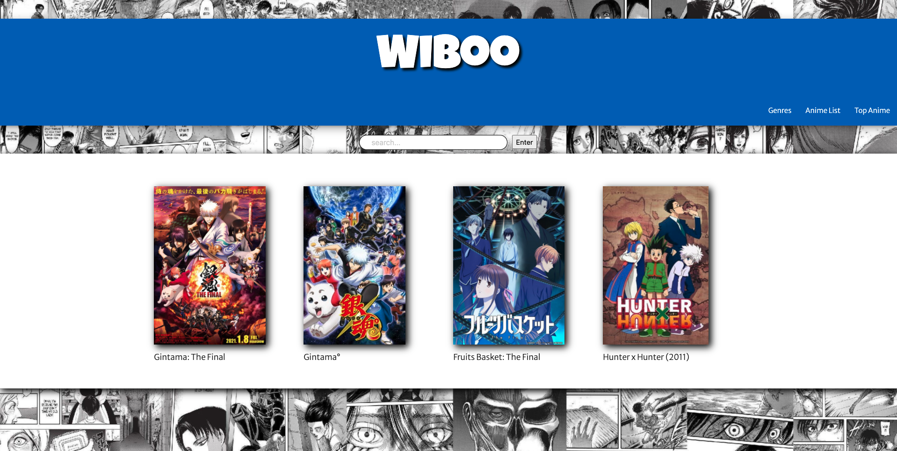
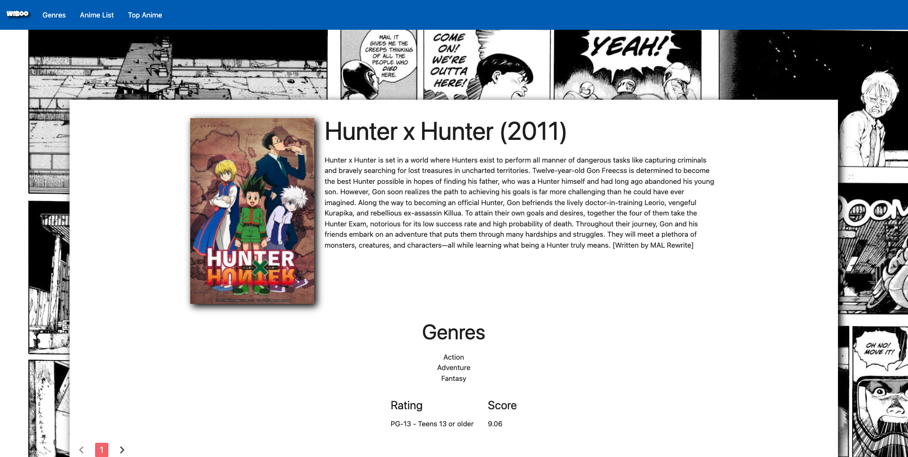
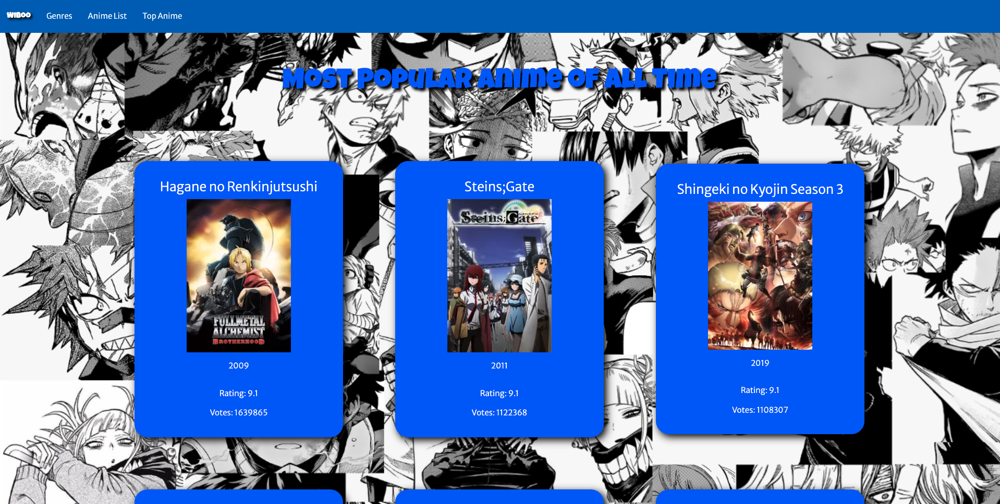
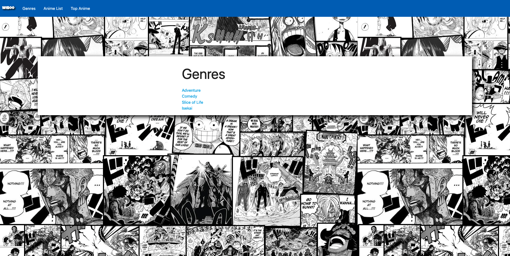
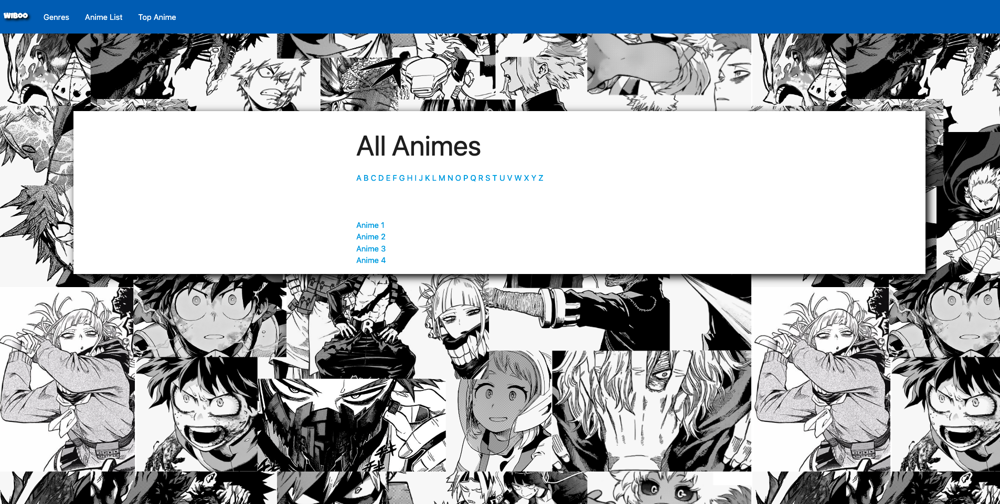

# Wiboo

## User-Story:

As a user of Wiboo.com I want to be able to search anime titles and different categories of anime so that I will be able to figure out what to watch next. The end-user will click on the search bar and search anime by name or category. The three tabs: Home , Genre & Anime List will direct the end-user to either the homepage , a category list or complete anime library in Wiboo. The end-user can also click on the four revolving anime box cover art that is located under the search bar for quick access to anime selections .

## Acceptance Criteria:

Given the end-user is on the Wiboo website
When the user clicks on the search bar and types in an anime name or category
Then the anime will pop up with cover art , rating , and detailed description of the selected anime’s plot and story arc
When end-user clicks on the Home, Genre, or Anime List tab located on the top right of the website
Then the user will be able to go back to homepage , to a list of genres to pick from or a list of all anime shows on Wiboo.com
When the user refreshes the page
Then four new anime choices will render with their box cover art for the user to click on

## Credits:

- Jamie Rose Chu
- Eric Zhong
- Carl Rowans III
- John Tannous

### API's

- https://docs.api.jikan.moe/
- https://api.simkl.com/anime/best/

## Screenshots

## Repository

https://github.com/jamierose528/wiboo

## The Live Site

jamierose528.github.io/wiboo/
